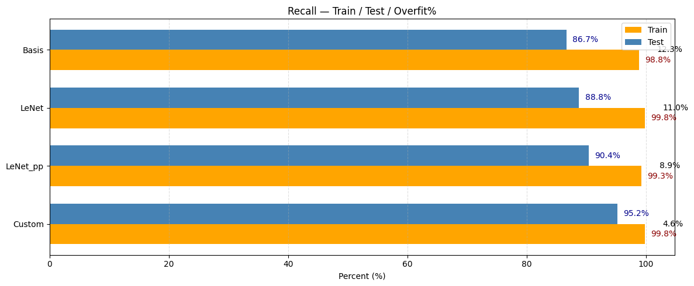
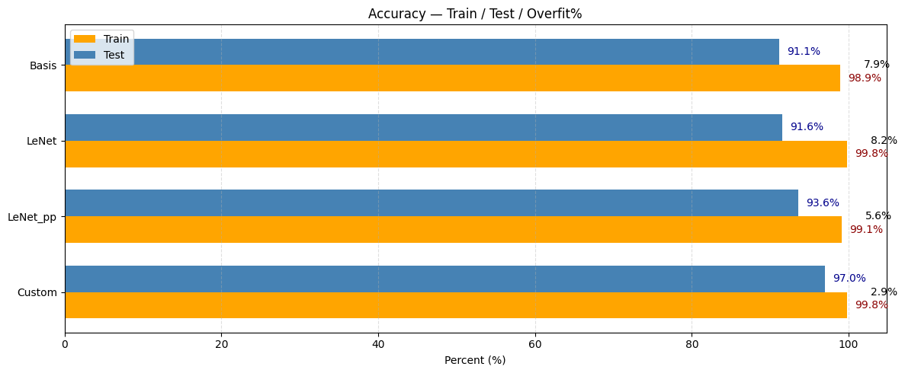
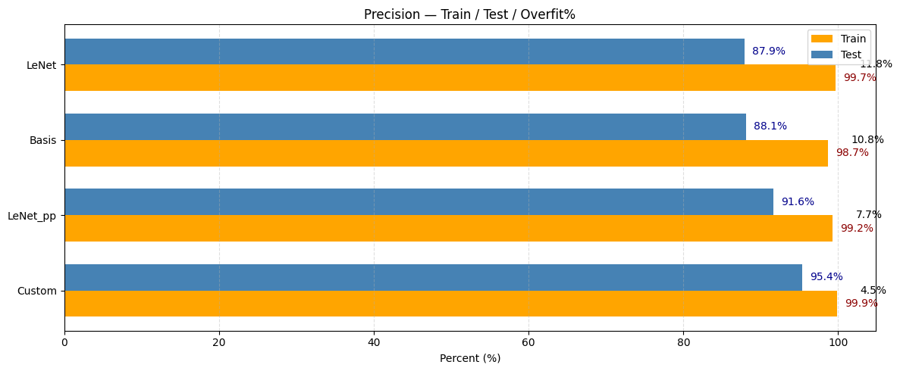
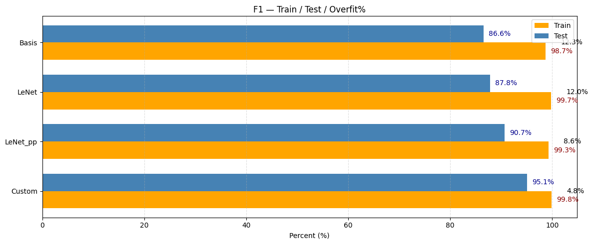
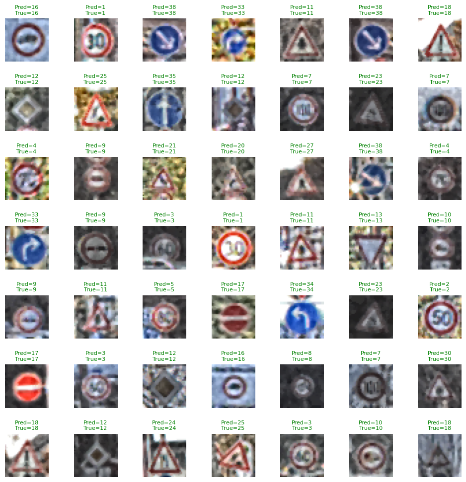

# 🚦 Traffic Sign Recognition — CV Project

A computer vision project for **multi-class traffic sign classification** using multiple CNN architectures, trained and evaluated in Google Colab with TensorFlow/Keras.

---

## 📌 Problem Statement

Traffic sign recognition is a tough real-world problem with high industrial value. This is a **multi-class classification task** with heavily imbalanced data. Signs differ in color, shape, and icons, but some sub-classes (like speed limits) look almost identical.

The classifier must handle:
- Lighting shifts and weather conditions
- Partial occlusions and rotations
- Large scale variations
- 43 visually diverse classes

While humans recognize signs with near-100% accuracy, it remains a real challenge for computer vision.

---

## 🗂️ Dataset — GTSRB (German Traffic Sign Recognition Benchmark)

| Property | Value |
|----------|-------|
| Total images | ~50,000 |
| Classes | 43 |
| Original source | ~133,000 labeled images, 2,416 sign instances |
| Recording | ~10 hours of driving in Germany (2010) |
| Camera | Prosilica GC 1380CH, 1360×1024px, 25 fps |
| Seasons | March, October, November |

The dataset was compiled by filtering tracks with fewer than 30 images and performing equidistant sampling to exactly 30 images per track — ensuring diversity and avoiding imbalance from near-identical consecutive frames.

> 📄 Original paper: [Stallkamp et al., GTSRB, IJCNN 2011](https://www.ini.rub.de/upload/file/1470692848_f03494010c16c36bab9e/StallkampEtAl_GTSRB_IJCNN2011.pdf)

---

## 🧠 Models Compared

Four CNN architectures were trained and evaluated:

| Model | Train Recall | Test Recall | Overfit Gap |
|-------|:-----------:|:-----------:|:-----------:|
| Basis | 98.8% | 86.7% | 12.3% |
| LeNet | 99.8% | 88.8% | 11.0% |
| LeNet_pp | 99.3% | 90.4% | 8.9% |
| **Custom** | **99.8%** | **95.2%** | **4.6%** ✅ |

> ✅ **Best model:** Custom CNN — highest test recall with the lowest overfitting gap.

---

## 🏗️ Custom Model Architecture

The best-performing model uses a deep CNN with progressive filter expansion, Batch Normalization, and aggressive Dropout for regularization.

### Preprocessing Pipeline

```
Raw image
  → CLAHE (Contrast Limited Adaptive Histogram Equalization, clipLimit=2.0, tileGrid=8×8)
  → Gaussian Denoising
  → Z-score Normalization (per-channel mean & std from train set)
```

### Data Augmentation (ImageDataGenerator)

| Technique | Value |
|-----------|-------|
| Rotation | ±10° |
| Zoom | 10% |
| Width shift | 10% |
| Height shift | 10% |
| Shear | 10° |

### Network Architecture

```
Input
  │
  ├─ Conv2D(32, 3×3, same) → BatchNorm → ReLU
  ├─ Conv2D(32, 3×3, same) → BatchNorm → ReLU
  ├─ MaxPooling2D(2×2)
  ├─ Dropout(0.25)
  │
  ├─ Conv2D(64, 3×3, same) → BatchNorm → ReLU
  ├─ Conv2D(64, 3×3, same) → BatchNorm → ReLU
  ├─ MaxPooling2D(2×2)
  ├─ Dropout(0.35)
  │
  ├─ Conv2D(128, 3×3, same) → BatchNorm → ReLU
  ├─ MaxPooling2D(2×2)
  ├─ Dropout(0.40)
  │
  ├─ Flatten
  ├─ Dense(256) → BatchNorm → ReLU
  ├─ Dropout(0.50)
  │
  └─ Dense(43, softmax)

Loss:      Sparse Categorical Crossentropy
Optimizer: Adam (lr=1e-3)
Metric:    Accuracy
```

---

## 📊 Results

### Recall (Train / Test / Overfit%)


### Accuracy


### Precision


### F1 Score


### Prediction Example


---

## 📁 Project Structure

```
CV_project-Traffic_sign_recognition/
│
├── notebooks/
│   └── traffic_sign_classification.ipynb   # Main Colab notebook
│
├── models/
│   ├── basis.py          # Baseline CNN
│   ├── lenet.py          # LeNet architecture
│   ├── lenet_pp.py       # LeNet++ (improved LeNet)
│   └── custom.py         # Custom CNN architecture
│
├── results/
│   ├── accuracy.png
│   ├── Precision.png
│   ├── F1.png
│   ├── recall.png
│   ├── predict.png
│   └── pic1.jpg
│
└── README.md
```

---

## 🚀 Quick Start

### Run in Google Colab
[](https://colab.research.google.com/github/Eruhonya/CV_project-Traffic_sign_recognition/blob/main/notebooks/traffic_sign_classification.ipynb)

### Local Setup

```bash
git clone https://github.com/Eruhonya/CV_project-Traffic_sign_recognition.git
cd CV_project-Traffic_sign_recognition
pip install -r requirements.txt
```

### Dependencies

```
tensorflow>=2.x
numpy
matplotlib
opencv-python
scikit-learn
pandas
```

---

## 🛠️ Tech Stack

| Tool | Purpose |
|------|---------|
| TensorFlow / Keras | Model building & training |
| OpenCV (CLAHE) | Image contrast enhancement |
| Google Colab | Training environment |
| Python 3 | Language |
| Matplotlib | Visualization |

---

## 📈 Future Work

- [ ] Data augmentation pipeline (brightness, noise, blur)
- [ ] Transfer learning (MobileNetV2, EfficientNet)
- [ ] Real-time detection via webcam
- [ ] Deploy as web or mobile app
- [ ] Extend to other country sign standards

---

## 👤 Author

**Eruhonya** — [github.com/Eruhonya](https://github.com/Eruhonya)

---

## 📄 License

This project is licensed under the MIT License.
